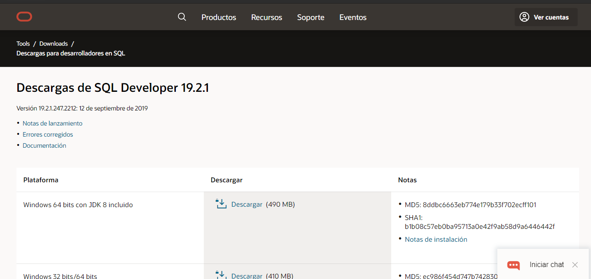
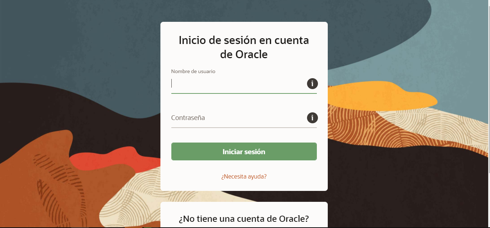

# Instructivo para crear Base Autónoma en Oracle 

## Tabla de contenidos

- [Instructivo para crear Base Autónoma en Oracle](#instructivo-para-crear-base-autónoma-en-oracle)
  - [Objetivo del instructivo](#objetivo-del-instructivo)
  - [Requisitos](#requisitos)
  - [Información a tener en cuenta](#información-a-tener-en-cuenta)
 - [Sección 1 Crear cuenta de Oracle Always Free](#sección-1-crear-cuenta-de-oracle-always-free)
 - [Sección 2 Crear base de datos Autónoma](#sección-2-crear-base-de-datos-autónoma)
 - [Sección 3 Descargar SQL Developer](#sección-3-descargar-sql-developer)
 - [Sección 4 Realizar conexión](#sección-4-realizar-conexión)
 - [Sección 5 Importar datos](#sección-5-importar-datos)
   - [Importar archivos Excel](#importar-archivos-excel)
   - [Importar archivo CSV TXT o DSV](#importar-archivo-csv-txt-o-dsv)
   - [Importar sin cabecera](#importar-sin-cabecera)
 - [Sección 6 Exportar datos](#sección-6-exportar-datos)

### Objetivo del instructivo

- Crear una cuenta en la Nube Always Free.
- Crear una base de datos Oracle Always Free.
- Descargar SQL Developer.
- Conectarse a la base de datos Oracle con SQL Developer. 
- Importar datos a la base utilizando archivos (Excel, TXT, etc).
- Exportar datos desde la base utilizando archivos  (Excel, TXT, etc).

### Requisitos

- Correo electrónico.
- Información personal.
- Contar con una tarjeta de crédito no prepaga (*Solo para que Oracle corrobore la identidad, no se realizará ningún cobro)*.
- Número telefónico.

### Información a tener en cuenta

Una cuenta free de Oracle Cloud proporciona lo siguientes servicios de por vida:

- 2 bases de datos en total, cada una con 1 CPU y 20GB de almacenamiento.
- 2 máquinas virtuales con 1/8 CPU y 1 GB de memoria c/u.
- 2 volúmenes de bloque *(100gb en total)*.
- 10 GB de almacenamiento de objetos.
- 10 GB de almacenamiento de archivos.
- Además de $300 dólares de crédito por 1 mes para probar cualquier producto o servicio dentro de la nube.

## Sección 1 Crear cuenta de Oracle Always Free

Para crear nuestra cuenta dentro de Oracle, debemos dirigirnos al siguiente link.

https://www.oracle.com/ar/cloud/free/

Ingresamos nuestra información personal.

Luego, recibiremos un mail para validar el email.

Ingresando a través del link, continuaremos el registro.

En nombre de compañía, de forma opcional pueden poner el nombre de UADE.

En región elegir **Latin America (Sao Paulo).**

Nuevamente, completamos con información personal.

Ingresamos nuestro número de teléfono.

> **Consejo:** Si no reciben el código SMS pueden contactarse con Oracle con el botón de ayuda. *(necesitaran hablar un poco de Inglés)*.

En category and product eligen las siguientes.

Luego de verificar el número de teléfono, debemos ingresar el método de pago.

 **AVISO**

> **Puede que se reciba un cobro de 1 dólar pero se cancela AUTOMATICAMENTE es solo para corroborar la cuenta.**

Cuenta creada. Ahora debemos esperar a que se procese. *(Puede tardar horas)*.

## Sección 2 Crear base de datos Autónoma

Primero debemos iniciar sesión.

Nos dirigimos a https://www.oracle.com/index.html

Ingresamos nuestro usuario.

Elegimos **Single Sign-On**.

Ingresamos con nuestro **correo electrónico**.

Una vez que estamos dentro de **Oracle Cloud**, nos dirigimos a "Almacén de datos autónomo".

Luego, entramos en "**Crear base de datos autónoma**".

Colocamos un nombre *(para mostrar)* y para la base de datos *(interno)*. Pueden ser el mismo.

Elegimos tipo de base *(preferentemente almacén de datos)* y compartida para ser gratuita.

Marcamos la casilla Siempre gratis.

Una vez marcada,  se configurará para **Always Free**.

Indicamos la contraseña para **ADMIN** *(Con ella ingresaremos a la base de datos para conectarnos)*.

Las configuraciones restantes podemos dejarlas por predeterminado. Clickeamos en **"Crear base de datos autónoma"**. 

Esperamos a que la base termine de ser creada.

## Sección 3 Descargar SQL Developer

Nos dirigimos a: https://www.oracle.com/ar/tools/downloads/sqldev-v192-downloads.html

Seleccionamos la versión adecuada para nuestro sistema operativo.

> NOTA: La versión JDK de 64 bits viene incluida con el JDK de Java (primer opción). Si tenemos un sistema de 32 bits, deberemos optar por descargar el JDK nosotros. link: https://www.oracle.com/java/technologies/javase/javase-jdk8-downloads.html

Nos pedirá crearnos una cuenta **Oracle**. No tendrá relación con la creada para la nube, esta cuenta la usaremos para descargar SQL Developer.

Ingresamos nuestros datos.

Una vez hayamos iniciado sesión, comenzará la descarga.

Luego, extraemos el archivo con WinRar o su programa de preferencia.

Dentro de la carpeta extraída, encontraremos el ejecutable.

## Sección 4 Realizar conexión 

Primero, debemos descargar la credencial de nuestra base. Para ello, ingresamos dentro de la Nube de Oracle. *(Mismo procedimiento que realizamos antes de crear la base)*.

Una vez dentro, nos dirigimos a "**Almacén de datos autónomo**". y seleccionamos nuestra base.

Una vez dentro, nos dirigimos a "**Conexión de base de datos**".

Descargaremos la cartera.

Nos pedirá una contraseña. Es por si perdemos el archivo, **no se utilizará para iniciar sesión.** 

Descargamos el archivo. Les recomiendo guardarlo en una carpeta accesible.

Una vez descargado, abrimos SQL Developer y nos dirigimos a "**Nueva galería**".

Elegimos la opción "**Capa de base de datos**".

- En nombre, elegimos el que queremos ya que es visual.
- En usuario colocamos **ADMIN**.
- En contraseña, introducimos la que **asignamos** para ADMIN cuando creamos la base.
- En tipo de conexión, **Cartera de Cloud** y en examinar seleccionamos el archivo que descargamos desde la página(***Wallet_NombreBase.zip***).

Nos debería quedar así.

Conectamos.

Nos pedirá nuevamente la contraseña.

**Ya estamos conectados.** :blush:

## Sección 5 Importar datos

Una vez conectados a la base, en la carpeta **Tablas(*Filtrado*)** hacemos click derecho, **importar datos.**

Se nos abrirá lo siguiente.

### Importar archivos Excel

En archivo, hacemos click en **examinar** y buscamos el archivo Excel.

Automáticamente nos detectará la cabecera. De ser necesario, la podemos desmarcar para colocarla nosotros mismos luego. [*(ir a colocar cabecera pasa saber más)*](#importar-sin-cabecera).

Luego, definiremos el nombre de la tabla.

Aquí podemos elegir que **columnas** deseamos seleccionar y en qué orden. Del lado se encuentran las deseadas con su respectivo orden.

Luego, nos permitirá cambiar tipo de datos entre otros o incluso **cambiar los nombres de las columnas**.

Y  por último, se importa la tabla.

**AVISO**

> Probablemente no podamos ver la tabla en la carpeta de "Tablas *(Filtrado)*" ya que debemos **refrescar** la conexión.

 

Resultado.

### Importar archivo CSV TXT o DSV

Nos dirigimos a **importar datos**, luego examinamos el archivo.

Tendremos **más opciones** que con archivos Excel. Aquí podemos elegir el *delimitador de columnas, terminador de línea, entre otros*.

En este caso *(un archivo CSV)*, debemos seleccionar el delimitador que utilizaremos entre columnas. En un CSV es **“;”** pero en un TXT puede ser cualquiera que este incluido ahí.

Luego, tendremos las mismas opciones que con los demás archivos.

> **Recordar REFRESCAR!!!!**

Resultado.

### Importar sin cabecera 

Seleccionamos el archivo que deseamos importar.

Como se observa, el archivo no tiene cabecera. Entonces, desmarcamos "**Cabecera**".

Luego, seleccionamos las columnas deseadas.

Ahora, definiremos los nombres de las columnas.

Luego, realizamos el mismo procedimiento que con los demás archivos. 

Resultado.

>**Recordar REFRESCAR!!**

## Sección 6 Exportar datos

Una vez conectados a la base, realizamos click derecho sobre la tabla *o tablas* que deseamos exportar. Seleccionamos **"Exportar".**

Se nos abrirá la siguiente pestaña.

Deseleccionamos DDL *(Está opción guarda otros archivos con información de la tabla que no es pertinente para lo que deseamos)*.

Aquí podemos elegir el formato de salida.

Tenemos varias opciones de como guardar la/s tabla/s. 

- Puede ser en un archivo único (*Si es Excel, las tablas estarán en el mismo archivo pero en distintas hojas*).
- Nos permite elegir si queremos o no cabecera (Excel 2003 en formato).
- Si es un archivo TXT, nos permite elegir el delimitador.

> *Aviso*
>
> *Cuidado con la extensión del archivo al examinar, ya que si ponemos la extensión incorrecta dará error.*

Aquí podemos **Especificar Datos**.

Archivo exportado.

Resultado.

